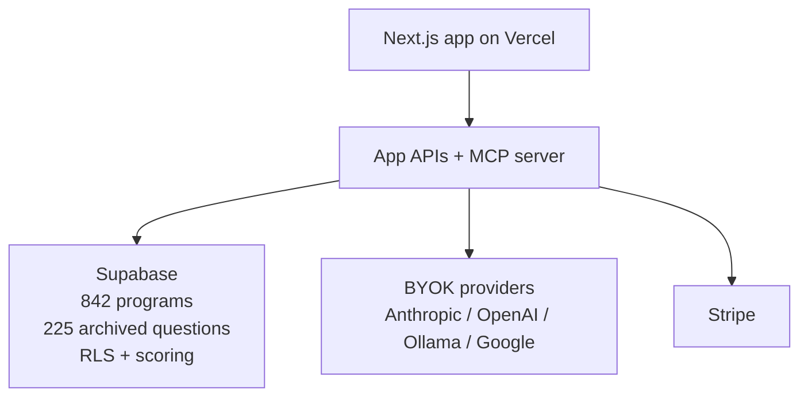

# Application Hub

**Founder-first application infrastructure for accelerators, grants, jobs, schools, and fellowships.**

[](https://github.com/SunrisesIllNeverSee/application-hub/actions/workflows/ci.yml)


Application Hub is a founder-first product built on a portable application graph. It turns recurring application questions into reusable assets, helps users build an answer bank that compounds over time, and exposes the full intelligence layer through both a web app and an MCP server.

The public wedge is startup opportunities. The underlying spine is broad enough to support grants, jobs, and school applications without a ground-up rebuild.

## What It Does

- Archives reusable application questions and scores them by significance
- Builds a reusable answer bank so one strong answer can travel across many opportunities
- Ranks opportunities with program DNA, fit scoring, and readiness signals
- Supports BYOK drafting, review persistence, and agent-side critique through MCP

## Who It’s For

- Founders applying to accelerators, fellowships, grants, and venture programs
- Power users working directly in Claude, Cursor, or Windsurf through MCP
- Future adjacent users in jobs, schools, and grants once those public surfaces expand

## Current State

| Surface | State |
|---|---|
| Live app | `https://mos2es.xyz` |
| Opportunity archive | 842 programs/opportunities |
| Question archive | 225 scored questions |
| MCP server | 21 tools, 7 resources, 3 prompts |
| Web product | Hub, Bank, workspace, profile split, imports, BYOK |
| Review layer | persisted reviews + stress tests + starter reviewer family |

## Architecture At A Glance



## Quick Start

### App

```bash
cd app
npm install
npm run type-check
npm run build
```

### MCP server

```bash
cd application-hub-mcp-server
npm install
npm run check
```

Prerequisites:
- live Supabase project with migrations through `027`
- app env vars for Supabase
- MCP env vars for Supabase service-role + anon access

## Repo Guide

- `ROADMAP.md` — sequence and leverage
- `TASKS.md` — implementation list
- `STATUS.md` — confirmed repo state
- `VISION.md` — product thesis and future shape
- `CLAUDE.md` / `AGENTS.md` / `SCRATCH.md` — active coordination layer
- `docs/ARCHITECTURE.md` — architecture overview
- `docs/MIGRATIONS.md` — migration chain and duplicate-prefix policy
- `docs/STRIPE_SETUP.md` — Stripe activation walkthrough
- `docs/BYOK_OLLAMA.md` — verified Ollama tunnel path
- `docs/21_curated_ingest_lane.md` — narrow staging/promotion rule for new targets
- `docs/archive/` — superseded and dated historical material

## MCP And Agents

Application Hub is not just a web app. The MCP server is a first-class product surface.

Current capabilities include:
- answer save/retrieval
- fit and ranking tools
- review-context bridge
- review write-back
- persisted stress tests

Checked-in reviewer family:
- `rns-answer-reviewer`
- `program-fit-reviewer`
- `fidelity-certifier`
- `stress-test-conductor`

## Contributing And Operating

- See `CONTRIBUTING.md` for seed promotion and contribution guidance
- See `docs/09_launch_checklist.md` for launch validation
- See `docs/10_byok_and_draft_policy.md` for BYOK/runtime behavior
- See `docs/SECURITY.md` for security posture and secret-handling rules

## Vision

The point is not to build yet another AI writer. The point is to build infrastructure for the application graph: questions, answers, fit signals, review loops, and reusable identity material that gets stronger with use.

Founder applications are the wedge. Portability across adjacent application domains is the deeper moat.
