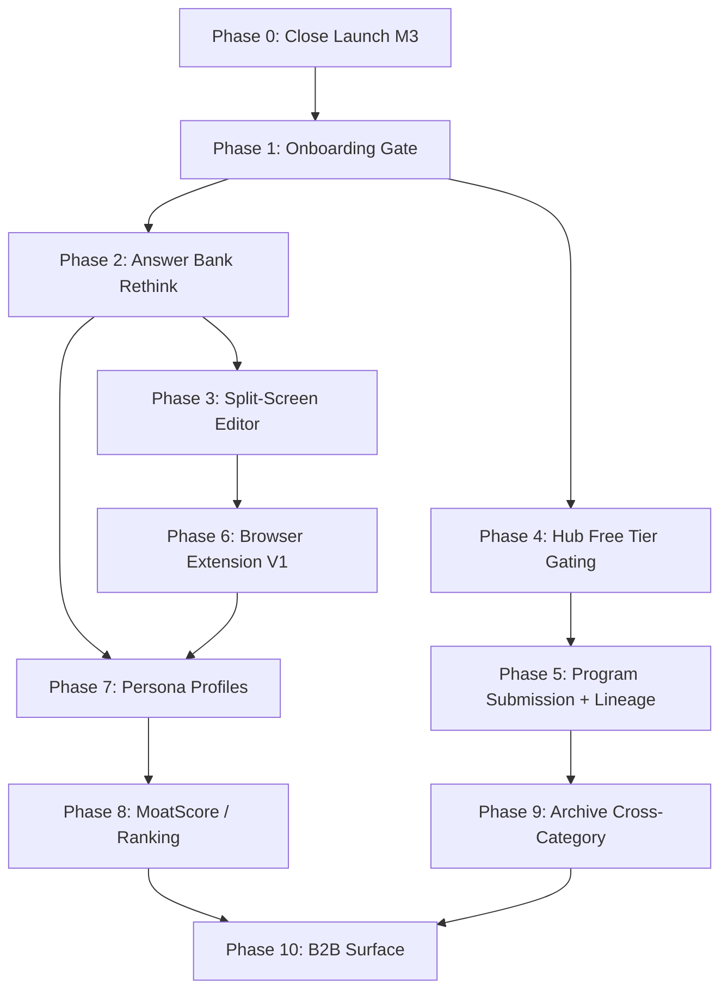

Here's a full sequential build plan mapped from `codex/feedback.md` against the current repo state, ordered by dependency chain — each phase unlocks the next.

---

## Phase 0: Close Out Launch Milestone 3 (Already In Progress)

**Status**: ~95% done. These are the last items blocking a credible public launch.

| Item | State | Source |
|---|---|---|
| Real deadlines seeded | Done per TASKS.md | [3-cite-0](#3-cite-0)  |
| Heat scores synthetic compute | Done per TASKS.md | [3-cite-1](#3-cite-1)  |
| AI draft smoke test (live BYOK) | Done per TASKS.md | [3-cite-2](#3-cite-2)  |
| Responsive QA pass | Done (landing page), rest still open | [3-cite-3](#3-cite-3)  |
| Recruiter agent activation | Edge fn deployed, needs `CRON_SECRET` + schedule activation | [3-cite-4](#3-cite-4)  |
| FundingCake promotion SQL | 39 rows ready, needs human review + run | [3-cite-5](#3-cite-5)  |
| Stripe price IDs in Vercel env | Deric to drive | [3-cite-6](#3-cite-6)  |

**Analysis**: This is just cleanup. The spine is shipped. Don't let these drag — they're operational tasks, not engineering blockers.

---

## Phase 1: Onboarding Gate (feedback.md §1.1–1.3)

**Why first**: Everything downstream (persona profiles, free tier gating, organic theme adaptation) depends on knowing who the user is from day one. Without this, users land on `/today` and are overwhelmed. The addendum confirms: "The gate isn't friction. It's the filter that gives every downstream data point context." [3-cite-7](#3-cite-7) 

**What to build**:
1. **Entry gate flow**: New user must either fill out "our application" (5-10 high-significance questions) OR upload an existing application before the full product opens [3-cite-8](#3-cite-8) 
2. **Theme detection**: Their answers seed their theme profile. System starts generalized, then gravitates toward their vertical (founder/student/researcher/job-seeker) as they feed it more applications [3-cite-9](#3-cite-9) 
3. **Progressive reveal**: Today dashboard, Hub, and Bank stay locked until the gate is completed. This prevents the "filing cabinet" problem where all three layers are visible before layer one has substance [3-cite-10](#3-cite-10) 

**What exists already**: The drip mechanic (migration 014), question embeddings (225 seeded at 768d), and profile split all support this. The schema is ready; it's a UX/routing layer. [3-cite-11](#3-cite-11) 

**Highlight**: This is the single highest-leverage UX change. It converts a confused first visit into a contextual relationship.

**Lowlight**: Requires careful design — the gate can't feel like a wall. The copy needs to communicate "this is how we personalize your experience" not "fill this out before we let you in."

**Solution**: Frame it as "Your first application" — make the gate itself feel like the product working. When they finish, show them: "Based on your answers, here's what we found for you." Immediate payoff.

---

## Phase 2: Answer Bank Rethink (feedback.md §2.1–2.2)

**Why second**: Once users have gone through the onboarding gate, they need a place to see and manage their answers. The current Answer Bank needs to match the vision: "only be answers in a text box form timestamp dated possible hashed... a captured moment... scrollable index of its contents... similar to VS Code and folder file editor." [3-cite-12](#3-cite-12) 

**What to build**:
1. **VS Code-style file tree** on the left — scrollable index of all answers, grouped by theme
2. **Each answer as a captured moment** — text box, timestamp, hash, version history
3. **Answer Bank fully separated from Profile** — already done architecturally (`/profile/answers` exists), but needs the UX overhaul to match the vision [3-cite-13](#3-cite-13) 

**What exists**: Standalone `/answers` route, answer history with diff view, `AnswerEditor` component with `StressTestPanel` wired in. [3-cite-14](#3-cite-14) 

**Highlight**: The "captured moment" framing is strong. Each answer becomes an artifact, not a draft. This is what makes the Answer Bank feel like an appreciating asset.

**Lowlight**: VS Code-style tree is a significant UX build. Don't over-engineer — start with a flat list sorted by theme, then iterate into a collapsible tree.

---

## Phase 3: Split-Screen Editor (feedback.md §9.2, addendum §9.3)

**Why third**: With the onboarding gate seeding the profile and the Answer Bank holding captured answers, the split-screen editor becomes the daily workspace. "Left panel: answer bank and persona profile. Right panel: the application being filled." [3-cite-15](#3-cite-15) 

**What to build**:
1. **Overleaf/Prism-style two-panel layout** — left side is question + answer editor, right side is live output/compiled view
2. **BYOK draft integration** lives naturally here — the user writes on the left, AI assists contextually, output renders on the right
3. **Copy-paste injection** stays easy — the right panel is the portable output [3-cite-16](#3-cite-16) 

**What exists**: `/api/draft` with BYOK routing, `AnswerEditor`, `StressTestPanel`, workspace with opportunity ranking. [3-cite-17](#3-cite-17) 

**Highlight**: This is what makes BYOK and draft feel like a "coherent workflow rather than a bolted-on feature" per the addendum. It's the UX that ties the product together. [3-cite-15](#3-cite-15) 

**Lowlight**: Big frontend build. This is essentially a new editor surface. Risk of scope creep into a full IDE.

**Solution**: V1 is simple — left panel shows the question + your answer bank entry for it + AI draft button. Right panel shows the compiled output formatted for copy-paste. Don't build a rich text editor — plain text with Markdown preview is enough for V1.

---

## Phase 4: Hub Free Tier Gating + Display Overhaul (feedback.md §4.1–4.2)

**Why fourth**: With the user onboarded and their workspace functional, now gate the discovery layer properly. "Free tier rotates or randomizes 50 opportunities every hour or every 4 6 or 12 hours... search filter best fit would all be premiums." [3-cite-18](#3-cite-18) 

**What to build**:
1. **Rotated free tier** — 50 programs visible, rotated every 4-12 hours, randomized per user
2. **Premium gates** — search, filter, best-fit ranking become Pro features
3. **Tab-style display** — check_size, equity, paid/unpaid, remote, travel, audience filter as column headers
4. **Column listing** — quickview rectangles, click to expand to the right

**What exists**: Hub with 842 programs, Funders index, program detail with TL;DR blocks, DNA radar charts, Stripe live. [3-cite-19](#3-cite-19) 

**Highlight**: This is the first real monetization gate beyond Stripe being wired. It creates genuine Pro upgrade pressure without making the free tier useless.

**Lowlight**: Rotation logic needs to feel fair, not random. If a user sees YC today and it's gone tomorrow, that's frustrating.

**Solution**: Use a deterministic rotation seeded by `user_id + date_bucket` so each user's set is stable within a window but different across users. Pin programs the user has interacted with (saved answers, started applications) so they never disappear.

---

## Phase 5: Program Submission + Lineage System (feedback.md §5.1, addendum)

**Why fifth**: With the hub gated and the user engaged, open up community-driven growth. "First person to submit a URL gets credit, timestamped, locked. That's essentially a prior art system for program discovery." [3-cite-20](#3-cite-20) 

**What to build**:
1. **Submit a Program** as a main tab/route — URL auto-filing with lineage credit
2. **Scrape pipeline** — background job extracts questions, deadlines, terms from submitted URLs
3. **Lineage credit** — first submitter gets timestamped credit, locked, feeds into the credits system (migration 032 already exists) [3-cite-21](#3-cite-21) 
4. **Immediate fit analysis** — submitter gets back their fit score + which banked answers apply + gaps [3-cite-22](#3-cite-22) 

**What exists**: `import_queue` table (migration 003), FundingCake ingest pipeline methodology, `credit_events` ledger, question embeddings for matching. [3-cite-23](#3-cite-23) 

**Highlight**: This is the flywheel. Users race to submit programs for credit, which is free crowdsourced data collection. The archive grows without a data team. Nobody else is doing this.

**Lowlight**: Scraping reliability varies wildly across portals. JS-heavy sites (13 already identified in needs_validation) will fail.

**Solution**: Two-track: automated scrape for clean HTML forms, manual template upload for everything else. Don't block on scrape perfection — the manual path (PDF/image/template upload per feedback.md §5.1) is the safety valve. [3-cite-24](#3-cite-24) 

---

## Phase 6: V1 Browser Extension (docs/23_v1_automation_plan.md)

**Why sixth**: With a growing Answer Bank, a working split-screen editor, and programs being submitted by the community, the copy-paste loop is the last friction point. The extension closes it. [3-cite-25](#3-cite-25) 

**What to build**:
1. **Chrome MV3 extension** — content script detects form fields on whitelisted portals
2. **Suggest mode first** (safer) — side panel shows matched answers, user clicks "Apply" per field
3. **Auto-fill mode later** — pre-populates fields when confidence ≥ 0.87
4. **5-portal whitelist**: Techstars, 500 Global, a16z Start, Solofounders, YC (amber) [3-cite-26](#3-cite-26) 

**What exists**: `/api/match-question` API route (done), pgvector RPC (done), question embeddings (done), full-text fallback (done). The backend is ready — only the extension itself is not started. [3-cite-27](#3-cite-27) 

**Highlight**: This is where the Answer Bank stops being theoretical and becomes physically useful in the real world. Massive UX payoff.

**Lowlight**: YC portal is amber per ToS audit. Ship without YC initially.

---

## Phase 7: Persona Profiles (feedback.md §3.3–3.4, addendum)

**Why seventh**: This requires data. By Phase 7, users have gone through onboarding, built Answer Banks, used the editor, submitted programs, and filled applications via the extension. Now there's enough signal to compute a persona. "As users fill out applications they develop a persona profile which would get to a state where they would have to fill out applications as much." [3-cite-28](#3-cite-28) 

**What to build**:
1. **Persona profile computation** — distilled from Answer Bank answers, stress-test results, application history, outcome data
2. **Three-layer stack**: answer bank (raw capture) → persona profile (distilled output) → recruiter scoring (monetization surface) [3-cite-10](#3-cite-10) 
3. **B2B surface** — employers/funders post an application and get immediate ranked recommendations based on persona profiles
4. **Profile abilities** — profiles become institutional with usage, best answers surface, recruiters can score against them [3-cite-29](#3-cite-29) 

**What exists**: User profiles table (migration 011), credits/achievements system (migration 032), fit scoring, program DNA, OG share cards. [3-cite-30](#3-cite-30) 

**Highlight**: This is "The Big One" per the feedback doc. It's the feature that breaks gatekeeping — applicants stop spraying, evaluators stop drowning. It's also the ICP flip: "The ICP isn't the person filling out applications — it's the programs creating the applications." [3-cite-31](#3-cite-31) 

**Lowlight**: Requires outcome tracking data that doesn't exist yet. Outcome tracking is checked off in TASKS.md but needs real user volume to be meaningful. [3-cite-32](#3-cite-32) 

**Solution**: Ship a "profile strength" meter first (how complete is your profile, how many answers, how many stress-tested). The full persona computation comes when you have 100+ users with enough answer data to make the distillation meaningful.

---

## Phase 8: MoatScore / FundScore / Founder Ranking (feedback.md §3.2–3.3, VISION.md)

**Why eighth**: Persona profiles provide the input. Now compute the scores. "Placeholder cards are on the Today dashboard. Needs scoring formula, data inputs, and compute job or RPC." [3-cite-33](#3-cite-33) 

**What to build**:
1. **MoatScore formula** — Answer Bank quality, stress-test survival rate, external signals, outcome track record [3-cite-34](#3-cite-34) 
2. **Internal applicant ranking** — where a founder likely ranks among applicants for a given program [3-cite-35](#3-cite-35) 
3. **Community dashboard** — stats, leaderboard, rate/rank answers [3-cite-36](#3-cite-36) 
4. **Scoring philosophy UI** — every score needs a "how is this calculated?" tooltip and the "Mathematical signal, not judgment" statement [3-cite-37](#3-cite-37) 

**Highlight**: This is where the platform becomes genuinely differentiated from every other application tool. A founder credit score that travels across programs.

**Lowlight**: Gameable if weighted toward volume. Must weight quality + stress-test survival, not just answer count.

---

## Phase 9: Archive Seeding — Cross-Category Expansion (feedback.md §6–7)

**Why ninth**: The founder wedge is validated by now. Expand the archive into adjacent verticals. "Top 100 schools, top 50 grant programs, 30-50 job application templates per sector. This is the data moat." [3-cite-38](#3-cite-38) 

**What to build**:
1. **University seeding** — top 250 schools by specialty, pull 20% of applications from each list [3-cite-39](#3-cite-39) 
2. **Grant seeding** — academic research, student scholarships, business grants, federal/private [3-cite-40](#3-cite-40) 
3. **Jobs archive (static)** — 30-50 applications per sector, historic/learning archive, not competing with Indeed [3-cite-41](#3-cite-41) 
4. **Cross-theme portability** activated — the schema is already portable by design [3-cite-42](#3-cite-42) 

**Highlight**: This is where the moat becomes infrastructure, not just a niche tool. "A question graph that can switch themes without a rebuild is infrastructure." [3-cite-43](#3-cite-43) 

**Lowlight**: Massive data collection effort. Don't try to boil the ocean — seed 20% of each category first and let community submission (Phase 5) fill the rest.

---

## Phase 10: B2B Surface + Competitive Landscape (feedback.md §8, addendum ICP)

**Why last**: This requires everything before it — a large archive, persona profiles, scoring, and enough applicant volume to be valuable to programs. "Programs stop broadcasting into the void and start pulling from a live ranked pool." [3-cite-44](#3-cite-44) 

**What to build**:
1. **Program-side dashboard** — programs post applications, get ranked recommendations from persona profiles
2. **Funder webhooks** — "notify me when high-fit founder applies"
3. **Verified/featured listings** — $299/$999 per cycle [3-cite-45](#3-cite-45) 
4. **Hosted applications** — Application Hub becomes the canonical submission portal for partner programs [3-cite-46](#3-cite-46) 
5. **Competitive landscape recon** — Monster, Indeed, LinkedIn, Glassdoor, Greenhouse, Lever, Ashby integration/partnership mapping [3-cite-47](#3-cite-47) 

**Highlight**: This is where the revenue ceiling changes. "A university, a federal grant committee, an accelerator — they're not thinking about $10/month, they're thinking about what it costs to run an application cycle." [3-cite-31](#3-cite-31) 

---

## Dependency Flow

---

## Overall Assessment

**Highlights:**
- The MVP spine is remarkably complete for this stage — 842 programs, 225 questions, BYOK, Stripe live, credits system, embeddings, MCP server with 21 tools
- The ICP flip (programs are the customer, applicants are the product) is the most important strategic insight in the whole document [3-cite-31](#3-cite-31) 
- The retention thesis is sound — users already have 9 more applications to fill out [3-cite-48](#3-cite-48) 
- The lineage system is an underrated moat — free crowdsourced data collection via competitive credit-claiming [3-cite-20](#3-cite-20) 

**Lowlights:**
- The onboarding gate is the biggest missing piece and everything downstream depends on it
- MoatScore/FundScore are still placeholders — the Today dashboard shows cards with no compute behind them [3-cite-49](#3-cite-49) 
- The pricing matrix has 4 tiers with 16+ gated features before there are 100 users — simplify to Free/Pro for now [3-cite-50](#3-cite-50) 
- Vision Tier in ROADMAP.md is still unpruned and creates an illusion that everything is "next" [3-cite-51](#3-cite-51) 

**The sequencing logic**: Each phase produces the data/infrastructure the next phase needs. The onboarding gate produces user context → the Answer Bank stores it → the editor makes it usable → the hub gates discovery → community submission grows the archive → the extension closes the copy-paste loop → persona profiles distill the accumulated data → scores quantify it → cross-category seeding scales it → B2B monetizes it. Nothing is out of order.

-------
What to build
1. Onboarding flow route
Create a new route at app/app/(app)/onboarding/page.tsx (or similar)
New users who haven't completed onboarding get redirected here from /today, /hub, /bank, and other app routes
Track onboarding completion in the user's profile or a new user_onboarding table
2. Entry gate UI
Present 5-10 high-significance questions from the existing archived_questions table (use significance_score to select the best ones, filtered by is_universal = true)
Alternative path: "Upload an application you're working on" — simple text paste or file upload that gets parsed into Q&A pairs
Each answered question saves to the user's Answer Bank (profile_answers table) via the existing save mechanism
3. Theme detection from gate answers
After the user completes the gate, analyze their answers to determine their primary vertical (founder/student/researcher/job-seeker)
Use the existing question theme taxonomy (All · Universal · Team · Traction · Problem · Solution · Market · Vision · Technical · Business · Fundraising · Personal · Fit · Impact) to weight which themes the user gravitates toward
Store the detected theme/vertical in user_profiles
4. Progressive reveal
Until onboarding is complete, the /today dashboard, /hub, and /bank routes should show a minimal state or redirect to /onboarding
After completion, show a "Based on your answers, here's what we found for you" transition that surfaces their fit scores and matched programs
This uses existing user_program_fit scoring
5. Middleware/guard
Add an auth middleware check or layout-level guard in app/app/(app)/layout.tsx that checks whether the current user has completed onboarding
If not, redirect to the onboarding flow
Existing users (who signed up before this feature) should be grandfathered in or shown an optional "complete your profile" prompt
Key files to reference
app/app/(app)/today/page.tsx — current landing page
app/app/(app)/bank/page.tsx — Question Bank with unlock/drip logic
app/components/AnswerEditor.tsx — existing answer editing component
codex/feedback.md lines 51-57 — original vision for the onboarding gate
VISION.md lines 77-94 — drip-fed onboarding spec
Migration 014_question_bank_drip.sql — existing drip/unlock mechanics to build on
Framing
The gate should feel like the product working, not a wall. Copy should say something like "Let's start with your first application" — make it feel like immediate value, not a prerequisite.